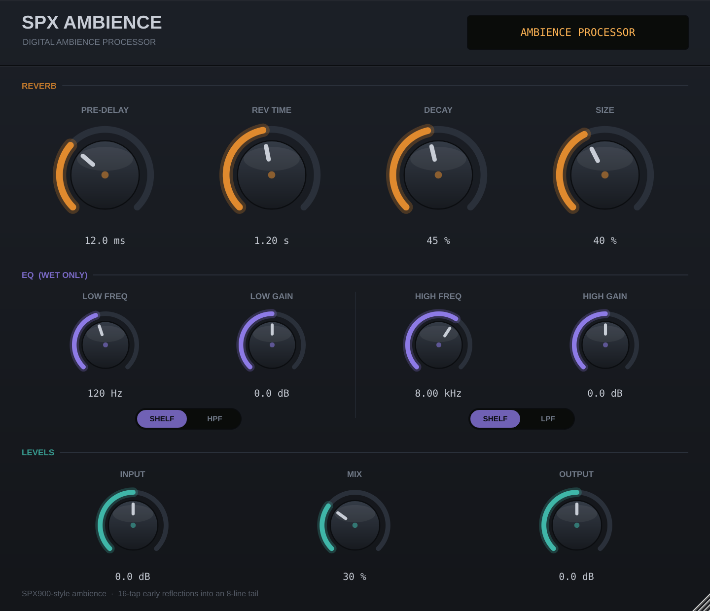

# SPX Ambience

A small, dense ambience reverb for macOS, voiced after the **Yamaha SPX900
"Ambience"** algorithm and the **Waves H-Reverb Ambience** preset: a thick
early-reflection cluster in front of a modest, slightly dark tail. It is built
for the short end — the 0.2–2 s room tone you put on drums, vocals and guitars
to make them sound like they were recorded somewhere — but the Reverb Time
control reaches all the way to 10 s when you want a wash.

Builds as **AU**, **VST3** and a **Standalone** app, as a universal
(Apple Silicon + Intel) binary.




## Quick start

On a Mac, from a clone of this repository:

```sh
./build-macos.sh
```

That checks your prerequisites, builds a universal Release binary, installs
the AU and VST3 into `~/Library/Audio/Plug-Ins`, ad-hoc signs them and runs
Apple's `auval` on the Audio Unit. The first run takes a few minutes because
JUCE is downloaded and compiled; later runs are quick. Then rescan plugins in
your DAW and look for **SPX Ambience** under *Connor Corwin*.

You need the Xcode command line tools (`xcode-select --install`) and CMake
(`brew install cmake`). The script tells you if either is missing.

| Format | Where it goes | Hosts |
|---|---|---|
| AU | `~/Library/Audio/Plug-Ins/Components` | Logic Pro, GarageBand, Live, Reaper |
| VST3 | `~/Library/Audio/Plug-Ins/VST3` | Ableton Live, Reaper, Studio One, Bitwig, Cubase, FL Studio |
| Standalone | `build/SPXAmbience_artefacts/Release/Standalone` | runs on its own, no host |

**Pro Tools is the exception.** It only loads AAX, and building AAX requires a
paid Avid developer agreement and PACE signing, so it is not something this
project can produce. Every other major macOS DAW is covered by the AU or the
VST3.

## Controls

| Control | Range | What it does |
|---|---|---|
| **Input** | −24 … +24 dB | Level into the processor. Affects dry and wet together. |
| **Pre-Delay** | 0 … 250 ms | Gap between the dry signal and the first reflection. 10–30 ms keeps a vocal in front of the room; longer separates them. |
| **Rev Time** | 0.1 … 10 s | RT60 of the late tail. The control is skewed so most of the travel sits in the short ambience range. |
| **Decay** | 0 … 100 % | Shape of the **early reflection** envelope — how quickly the reflection cluster dies away. Low is a tight, close room; high is a longer, more open spray. This is a separate control from Rev Time, exactly as it is on the SPX900. |
| **Size** | 0 … 100 % | Room scale, 0.45× to 1.9×. Stretches both the reflection pattern and the tail network together, so the room grows rather than just getting longer. |
| **Mix** | 0 … 100 % | Dry/wet, equal power. At 0 % the dry signal passes through bit-identical, so the plugin is safe to leave inserted. |
| **Output** | −24 … +24 dB | Level out. |

### EQ (wet only)

Two bands that shape the reverb and leave the dry signal alone, so the 0 % mix
bypass stays bit-perfect no matter how the EQ is set. They meet at 1.5 kHz.

| Control | Range | What it does |
|---|---|---|
| **Low Freq** | 20 Hz … 1.5 kHz | Corner frequency of the low band. |
| **Low Gain** | −6 … +6 dB | Shelf amount. Greys out in HPF mode. |
| **High Freq** | 1.5 kHz … 20 kHz | Corner frequency of the high band. |
| **High Gain** | −6 … +6 dB | Shelf amount. Greys out in LPF mode. |
| **Shelf / HPF** | Low band | **Shelf** boosts or cuts below the corner. **HPF** ignores Gain and becomes a 12 dB/octave high-pass. |
| **Shelf / LPF** | High band | **Shelf** boosts or cuts above the corner. **LPF** ignores Gain and becomes a 12 dB/octave low-pass. |

Set the Low band to HPF and the High band to LPF and you have a band-pass
across the reverb.

Both bands default to Shelf at 0 dB, which is skipped in the signal path
entirely rather than computed as a flat filter. Every factory preset leaves
them there, so presets sound exactly as they did before the EQ existed.

**One thing to know:** the wet path already runs through a fixed 12.5 kHz
low-pass that emulates the SPX900's 31.25 kHz converters, and that stays in
place. It is a lot of why this sounds like the hardware. The practical effect
is that the High band has little audible reach above ~12.5 kHz — the top of
its range is there for completeness, not because it does much.

Six factory programs are included (SPX Ambience, Tight Room, Drum Ambience,
Vocal Space, Wide Chamber, Long Hall), reachable from the host's program menu.

### Why Decay and Rev Time are separate

On the SPX900 the ambience algorithms expose both, and they do different jobs:
`DECAY` governs the early reflection cluster, `REV TIME` governs the tail
behind it. Keeping them apart is most of what makes the box sound like a room
rather than a reverb — you can have a tight, snappy cluster over a long tail,
or a long spray over almost no tail.

## Building by hand

`build-macos.sh` above wraps this, but the plain CMake path is:

```sh
cmake -S . -B build -DCMAKE_BUILD_TYPE=Release
cmake --build build -j
```

JUCE 8.0.15 is fetched automatically on the first configure. If you already
have a JUCE checkout, point at it and skip the download:

```sh
cmake -S . -B build -DCMAKE_BUILD_TYPE=Release -DJUCE_PATH=/path/to/JUCE
```

`COPY_PLUGIN_AFTER_BUILD` is on, so a successful build installs to:

- `~/Library/Audio/Plug-Ins/Components/SPX Ambience.component`
- `~/Library/Audio/Plug-Ins/VST3/SPX Ambience.vst3`

The standalone app lands in
`build/SPXAmbience_artefacts/Release/Standalone/`.

Logic caches its plugin scan, so after the first install run:

```sh
killall -9 AudioComponentRegistrar
auval -v aufx Spxa Ccor
```

### Signing

`build-macos.sh` ad-hoc signs both bundles for you. To do it by hand (Apple
deprecated `--deep` for signing, so sign each bundle directly):

```sh
codesign --force --sign - ~/Library/Audio/Plug-Ins/Components/"SPX Ambience.component"
codesign --force --sign - ~/Library/Audio/Plug-Ins/VST3/"SPX Ambience.vst3"
```

An ad-hoc signature is enough for your own machine. Distributing to someone
else needs a Developer ID certificate and notarisation.

## Rendering audio offline

`SPXAmbienceRender` runs a file through every factory preset and writes one
WAV per preset, which is the quickest way to compare the presets against each
other — or this reverb against another one — without a DAW in the way. It is
built by default alongside the plugin:

```sh
./build/SPXAmbienceRender_artefacts/Release/SPXAmbienceRender drums.wav
```

That writes six 24-bit WAVs into `drums renders/` next to the input, each with
enough silence appended that the tail is not cut off.

| Option | Effect |
|---|---|
| `--mix 100` | Override every preset's mix. 100 renders wet only, which is what you want when A/B-ing against another reverb. |
| `--tail 6` | Fixed tail length in seconds, instead of the automatic reverb time + pre-delay + 0.5 s. |
| `--preset 3` | Render one preset only (1-based). |
| `--list` | Print the presets and their settings. |

Any format JUCE reads works as input, mono or stereo; output is always 24-bit
stereo at the input's sample rate. The renderer runs the same engine as the
plugin, driven from the same table in `Source/Presets.h`, so a render is what
that program sounds like in a host.

## Regenerating the screenshot

The image above is rendered from the real editor, with no host and no
display, by `tools/PreviewRender.cpp`:

```sh
cmake -S . -B build -DSPX_BUILD_PREVIEW=ON
cmake --build build --target SPXAmbiencePreview
./build/SPXAmbiencePreview_artefacts/Debug/SPXAmbiencePreview docs/plugin.png 2
```

It is also a quick way to check that `paint()` and `resized()` still run
clean after a layout change.

## Testing the DSP

The reverb core in `Source/dsp/` has **no JUCE dependency**, so it builds and
runs anywhere:

```sh
cmake -S . -B build-test -DSPX_BUILD_PLUGIN=OFF
cmake --build build-test -j
ctest --test-dir build-test --output-on-failure
```

`tools/DspTest.cpp` measures, at 44.1 / 48 / 96 kHz:

- **RT60 tracking** — 500 Hz octave-band T30 by Schroeder backward
  integration, against the Reverb Time control, from 0.3 s to 10 s. Currently
  within 4 %.
- **Decay** spreading the reflection cluster without acting as a level control.
- **Size** pushing reflection energy later.
- **Pre-delay** offsetting the wet onset.
- **L/R decorrelation** of the impulse response.
- **Bypass transparency** at 0 % mix (bit-identical), including with the EQ
  in HPF/LPF mode, which is what proves the EQ is wet-only.
- **Tone filter responses** — shelf gains at ±6 dB, and −3 dB at the corner
  with 12 dB/octave beyond it for the HPF and LPF modes, measured by DFT of each
  filter's impulse response.
- **EQ neutrality** — a 0 dB shelf produces a bit-identical impulse response
  whatever its frequency.
- **EQ effect on the tail** — octave-band energy before and after, with a
  cascaded analyser steep enough that out-of-band leakage does not dominate
  the reading.
- **Stability** — a minute of silence after a full-scale burst into a 10 s
  tail, checking for NaN, runaway feedback and denormal stalls.

## Cost

Measured on the container this was developed in (x86-64, `-O2`), rendering
60 s of stereo audio at a 2 s reverb time. Figures move around with machine
and load, so treat them as an order of magnitude rather than a spec:

| Sample rate | EQ flat | EQ engaged |
|---|---|---|
| 44.1 kHz | 0.45 % of one core | 0.53 % |
| 48 kHz | 0.48 % | 0.56 % |
| 96 kHz | 0.96 % | 0.98 % |

"EQ engaged" is the worst case, with both bands filtering rather than being
skipped. At their 0 dB defaults the bands cost nothing at all, because they
are bypassed rather than computed.

Reproduce with `tools/DspBench.cpp`:

```sh
cmake --build build-test --target SPXAmbienceDspBench
./build-test/SPXAmbienceDspBench
```

## How it works

```
in ─┬─────────────────────────────────────────────── dry ──┐
    │                                                       │
    └─ pre-delay ─ 85 Hz HP ─ 12.5 kHz LP ─┬─ 16-tap ER ──┬─┴─ mix ─ out
                                            │              │
                                            └─ 4 allpass ─ 8×8 FDN ┘
```

- **Band limiting.** The SPX900 ran at a 31.25 kHz sample rate. The wet path is
  rolled off at 12.5 kHz to keep that darker, slightly grainy character, with
  an 85 Hz highpass so long tails don't build up mud.
- **Early reflections.** Sixteen taps per channel, two decorrelated patterns,
  signed so the cluster doesn't comb-filter into a single smear. Tap gains are
  shaped by an exponential envelope whose time constant is the Decay control
  (8 ms to 160 ms), then normalised to constant energy so Decay changes the
  room and not the level.
- **Diffusion.** Four series Schroeder allpasses per channel ahead of the tail,
  which is what builds density fast enough to sound like a real small room.
- **Late tail.** An 8-line feedback delay network with an orthogonal
  Householder mixing matrix and slow, mutually detuned modulation (~2 samples)
  to break up metallic ringing.
- **Damping.** Each line uses a Jot-style absorbent filter that folds the
  feedback gain and the high-frequency damping into one element: DC gain sets
  the requested RT60, and the pole sets high frequencies to decay at 0.35× that
  time. A plain lowpass in the loop would also attenuate low frequencies on
  every pass — that costs about half the requested decay time, which is exactly
  what the RT60 test caught during development.
- **Mono send.** Like the hardware, the reverb is fed from a mono sum. It keeps
  the reflection pattern stable and avoids phase problems on stereo sources;
  the returns are stereo.
- **Tone controls.** Two RBJ biquads per channel on the wet sum, after the DC
  blocker and before the dry/wet mix. Coefficients are recalculated at control
  rate from smoothed values, with frequency smoothed in the log domain so a
  sweep sounds even rather than rushing at the bottom. A band sitting at 0 dB
  in Shelf mode is skipped outright, and its filter state is reset when it
  switches back in so it cannot pop.

## Licence

JUCE 8 is licensed under AGPLv3 or a commercial JUCE licence. (JUCE 8 no
longer has a splash screen, so there is no flag to set either way.) Building
this for your own use is unaffected. If you want to distribute a binary, you
either release your source under the AGPL or buy a JUCE licence.
